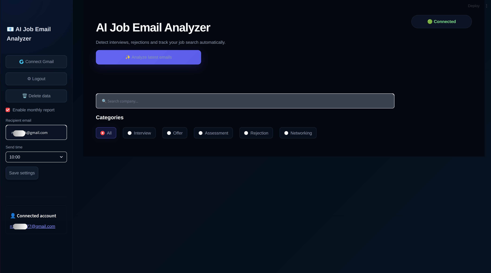

# AI Email Application Tracker


An AI-powered application that automatically analyzes recruitment emails from a connected Gmail account.

The system identifies job-related emails, classifies them into recruitment stages such as interview invitations, offers, assessments and rejections, and presents the results in an interactive dashboard.

Users can search, filter and export the analyzed emails as a PDF report.

## Overview

Managing recruitment emails can quickly become overwhelming during a job search.

Important interview invitations or offers are often mixed with newsletters, promotions and other personal emails.

This application automatically analyzes Gmail messages using AI and extracts only recruitment-related communication.

The application allows users to:

- Connect a Gmail account securely using Google OAuth
- Analyze recent emails with an LLM
- Detect recruitment-related messages
- Classify emails into hiring stages
- View results inside a dashboard
- Search by company
- Filter by recruitment category
- Export analyzed emails as a PDF report

<table>
  <tr>
    <td align="center">
      <b>Start Screen</b><br/>
      
    </td>
  </tr>
</table>

## Features

- Gmail OAuth authentication
- Automatic retrieval of recent Gmail messages
- AI-powered recruitment email analysis
- Detection of job-related emails only
- Classification into:
  - Interview Invitation
  - Interview Follow-up
  - Assessment
  - Offer
  - Rejection
  - Application Received
  - Networking
- Company extraction
- Email summary generation
- Search by company
- Category filtering
- Dashboard statistics
- PDF export
- Responsive Streamlit interface

## Email Analysis

The application connects to Gmail and retrieves the latest emails.

Each email is processed by an LLM that determines:

- whether the email is recruitment related
- recruitment stage
- company name
- detected language
- date
- concise summary

Only recruitment-related emails are displayed in the dashboard.

## Dashboard

The dashboard provides:

- Total recruitment emails
- Interview count
- Offer count
- Rejection count

Users can additionally:

- Search companies
- Filter recruitment stages
- View detailed email cards
- Export results to PDF

### Background Agent

The project also includes a background worker.

The worker periodically:

1. Connects to Gmail
2. Fetches new emails
3. Runs AI analysis
4. Detects new recruitment emails
5. Updates stored results

This enables continuous monitoring without manually checking the inbox.

### PDF Export

Users can export all filtered recruitment emails into a structured PDF report.

Each entry contains:

- Company
- Category
- Date
- Summary
- Language

### System Workflow

1. User connects Gmail
2. Google OAuth authentication
3. Latest emails are downloaded
4. Gemini analyzes every email
5. Job-related emails are extracted
6. Dashboard displays results
7. User searches or filters emails
8. Results can be exported as PDF
        
### Technologies

- Python
- Streamlit
- Google Gmail API
- Google OAuth 2.0
- Google Gemini API
- Pandas
- ReportLab

## Limitations

- Only the latest emails are analyzed.
- Email classification depends on LLM reasoning.
- Incorrect summaries or classifications may occasionally occur.
- Recruitment emails written in uncommon formats may not be detected correctly.

## Privacy

- Gmail access is read-only.
- Emails are processed only for analysis.
- OAuth credentials remain on the user's machine.
- The application does not intentionally store email content permanently

### Ethics & Safety

This application is intended to assist users during the recruitment process.
AI-generated classifications should be reviewed by the user before making important decisions.


## Installation

### Install dependencies

This project uses `uv` for Python dependency management.

```bash
uv sync
```

### Configure environment variables

Create a `.env` file in the project root:

```bash
cp .env.example .env
```

Add your Gemini API key:

```env
GEMINI_API_KEY=your_gemini_api_key
```
## How to Run

Start the Streamlit application:

```bash
uv run streamlit run email_check_app.py
```

The application will be available at:

```text
http://localhost:8501
```

## Gmail Authentication

The application uses Google OAuth 2.0 to access Gmail in read-only mode.

Each user must configure their own Google OAuth credentials.

### 1. Create a Google Cloud project

Create a project in Google Cloud Console.

### 2. Enable the Gmail API

Enable the Gmail API for the project.

### 3. Configure the OAuth consent screen

Configure the OAuth consent screen for the application.

### 4. Create OAuth credentials

Create an OAuth 2.0 Client ID for a Desktop application.

### 5. Download the credentials

Download the generated JSON credentials file.

Rename it to:

```text
client_secret.json
```

Place it in:

```text
core/client_secret.json
```

The file is generated by Google Cloud. It should not be created manually.

### OAuth token

After successful authentication, the application creates:

```text
token.json
```

This file is specific to the user's Gmail account and must not be committed to GitHub.
## Docker

The application can also be run using Docker.

The Docker image uses `uv` for dependency management.

### Build the Docker image

```bash
docker build -t email-tracker .
```

### Run the container

```bash
docker run --env-file .env -p 8501:8501 email-tracker
```

The application will be available at:

```text
http://localhost:8501
```

### Docker Compose

The application can also be started with Docker Compose:

```bash
docker compose up --build
```

The application will be available at:

```text
http://localhost:8501
```

To stop the application:

```bash
docker compose down
```

> Gmail OAuth uses browser-based authentication. Running the OAuth flow inside a container may require additional configuration depending on the deployment environment. For local development, running the application directly with `uv` is recommended.

## Application Preview

</table>
    <td align="center">
      <b>Email Analysis & Results</b><br/>
      
    </td>
  </tr>
</table>

